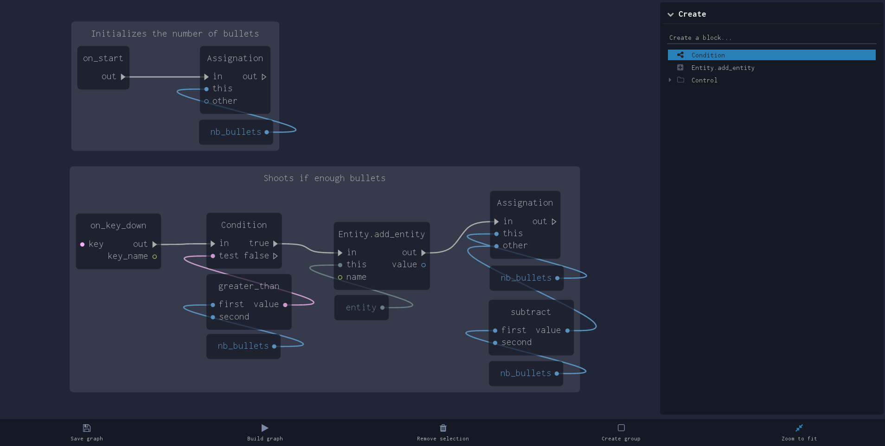

DudeGraph
=========

DudeGraph is a graphic tool to allow users to create content from a simple node-based interface.
You can use dude-graph to create your own graphical language! And offer the ability to create new content without programming.



# Overview

DudeGraph is a set of two Polymer elements: `dude-graph-editor` and `dude-graph-inspector`

`dude-graph-editor` represents the SVG node-based interface, handles groups and blocks drag and drop and connection linking between block points.
`dude-graph-inspector` manipulates the editor and allows to create/remove groups and blocks, zoom to fit and edit selected block properties.

## Installation

``` bash
bower install --save dude-graph
```

## Quick start

``` sh
git clone https://github.com/dudeteam/dude-graph.git
cd dude-graph/
npm install && bower install
gulp
```

There are 2 demos available with Polymer: 
* demo/dude ``` http://localhost:8080/components/dude-graph/demo ``` (Complete example, with save/load in localStorage)
* demo/basic ``` http://localhost:8080/components/dude-graph/demo/basic.html ``` (Basic demo)

## I don't want to use Polymer

That's perfectly fine, you can achieve the same result as with Polymer, feel free to explore the elements `dude-graph-editor` and `dude-graph-inspector` to see what's under the hood.

## Contribute

If you want to contribute, run the following command to test dude-graph:
``` gulp ```

Then open your favorite browser:
``` http://localhost:8080/components/dude-graph/ ``` for the Polymer documentation
``` http://localhost:8080/components/dude-graph/demo/ ``` for the demo.

Note: ``` gulp ``` will minify and concat all the sources in lib/ into the root script file ``` dude-graph.js ``` and will start ``` polyserve ``` on the default port (8080)